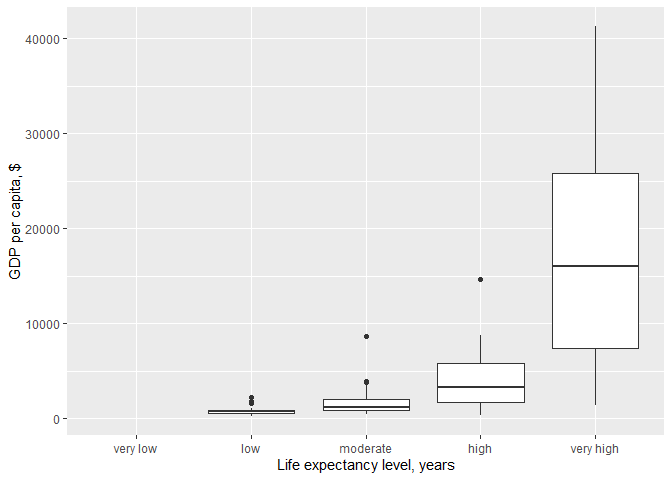
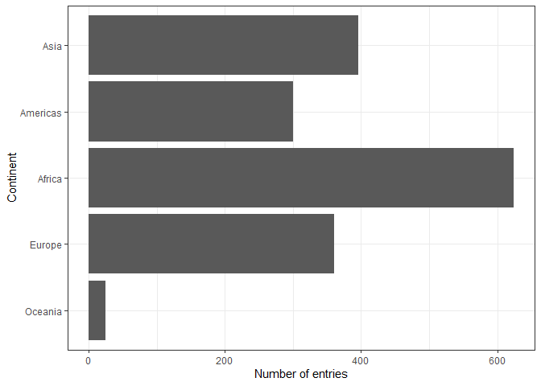
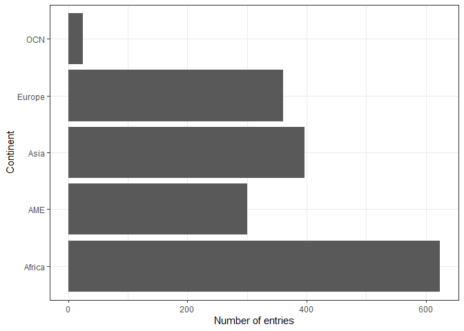

## Motivating the need for factors in R

### Activity 1: Using Factors for plotting 


```r
library(gapminder)
library(tidyverse)
```

**1.1** Let's look again into `gapminder` dataset and create a new cloumn, `life_level`, that contains five categories ("very high", "high","moderate", "low" and "very low") based on life expectancy in 1997. Assign categories accoring to the table below:

| Criteria | life_level| 
|-------------|-----------|
| less than 23 | very low |
| between 23 and 48 | low |
| between 48 and 59 | moderate |
| between 59 and 70 | high |
| more than 70 | very high |

Function `case_when()` is a tidier way to vectorise multiple `if_else()` statements. you can read more about this function [here](https://dplyr.tidyverse.org/reference/case_when.html).


```r
gapminder %>% 
  filter(year == 1997) %>% 
  mutate(life_level = case_when(lifeExp < 23 ~ "very_low",
                                lifeExp < 48 ~ "low",
                                lifeExp < 59 ~ "moderate",
                                lifeExp < 70 ~ "high",
                                TRUE ~ "very high")) %>% 
  ggplot() + geom_boxplot(aes(x = life_level, y = gdpPercap)) +
  labs(y = "GDP per capita, $", x= "Life expectancy level, years") +
  theme_bw() 
```

<!-- -->

Do you notice anything odd/wrong about the graph?

We can make a few observations:

- It seems that none of the countries had a "very low" life-expectancy in 1997. 

- However, since it was an option in our analysis it should be included in our plot. Right?

- Notice also how levels on x-axis are placed in the "wrong" order.

**1.2** You can correct these issues by explicitly setting the levels parameter in the call to `factor()`. Use, `drop = FALSE` to tell the plot not to drop unused levels 

```r
gapminder %>% 
  filter(year == 1997) %>% 
  mutate(life_level = factor(case_when(lifeExp < 23 ~ "very_low",
                                lifeExp < 48 ~ "low",
                                lifeExp < 59 ~ "moderate",
                                lifeExp < 70 ~ "high",
                                TRUE ~ "very high"),
                             levels = c("very low", "low", "moderate", "high", "very high"))) %>% 
  ggplot() + geom_boxplot(aes(x = life_level, y = gdpPercap)) +
  labs(y = "GDP per capita, $", x= "Life expectancy level, years") +
  scale_x_discrete(drop=FALSE)
```

<!-- -->

```r
  theme_bw() 
```

```
## List of 65
##  $ line                      :List of 6
##   ..$ colour       : chr "black"
##   ..$ size         : num 0.5
##   ..$ linetype     : num 1
##   ..$ lineend      : chr "butt"
##   ..$ arrow        : logi FALSE
##   ..$ inherit.blank: logi TRUE
##   ..- attr(*, "class")= chr [1:2] "element_line" "element"
##  $ rect                      :List of 5
##   ..$ fill         : chr "white"
##   ..$ colour       : chr "black"
##   ..$ size         : num 0.5
##   ..$ linetype     : num 1
##   ..$ inherit.blank: logi TRUE
##   ..- attr(*, "class")= chr [1:2] "element_rect" "element"
##  $ text                      :List of 11
##   ..$ family       : chr ""
##   ..$ face         : chr "plain"
##   ..$ colour       : chr "black"
##   ..$ size         : num 11
##   ..$ hjust        : num 0.5
##   ..$ vjust        : num 0.5
##   ..$ angle        : num 0
##   ..$ lineheight   : num 0.9
##   ..$ margin       : 'margin' num [1:4] 0pt 0pt 0pt 0pt
##   .. ..- attr(*, "valid.unit")= int 8
##   .. ..- attr(*, "unit")= chr "pt"
##   ..$ debug        : logi FALSE
##   ..$ inherit.blank: logi TRUE
##   ..- attr(*, "class")= chr [1:2] "element_text" "element"
##  $ axis.title.x              :List of 11
##   ..$ family       : NULL
##   ..$ face         : NULL
##   ..$ colour       : NULL
##   ..$ size         : NULL
##   ..$ hjust        : NULL
##   ..$ vjust        : num 1
##   ..$ angle        : NULL
##   ..$ lineheight   : NULL
##   ..$ margin       : 'margin' num [1:4] 2.75pt 0pt 0pt 0pt
##   .. ..- attr(*, "valid.unit")= int 8
##   .. ..- attr(*, "unit")= chr "pt"
##   ..$ debug        : NULL
##   ..$ inherit.blank: logi TRUE
##   ..- attr(*, "class")= chr [1:2] "element_text" "element"
##  $ axis.title.x.top          :List of 11
##   ..$ family       : NULL
##   ..$ face         : NULL
##   ..$ colour       : NULL
##   ..$ size         : NULL
##   ..$ hjust        : NULL
##   ..$ vjust        : num 0
##   ..$ angle        : NULL
##   ..$ lineheight   : NULL
##   ..$ margin       : 'margin' num [1:4] 0pt 0pt 2.75pt 0pt
##   .. ..- attr(*, "valid.unit")= int 8
##   .. ..- attr(*, "unit")= chr "pt"
##   ..$ debug        : NULL
##   ..$ inherit.blank: logi TRUE
##   ..- attr(*, "class")= chr [1:2] "element_text" "element"
##  $ axis.title.y              :List of 11
##   ..$ family       : NULL
##   ..$ face         : NULL
##   ..$ colour       : NULL
##   ..$ size         : NULL
##   ..$ hjust        : NULL
##   ..$ vjust        : num 1
##   ..$ angle        : num 90
##   ..$ lineheight   : NULL
##   ..$ margin       : 'margin' num [1:4] 0pt 2.75pt 0pt 0pt
##   .. ..- attr(*, "valid.unit")= int 8
##   .. ..- attr(*, "unit")= chr "pt"
##   ..$ debug        : NULL
##   ..$ inherit.blank: logi TRUE
##   ..- attr(*, "class")= chr [1:2] "element_text" "element"
##  $ axis.title.y.right        :List of 11
##   ..$ family       : NULL
##   ..$ face         : NULL
##   ..$ colour       : NULL
##   ..$ size         : NULL
##   ..$ hjust        : NULL
##   ..$ vjust        : num 0
##   ..$ angle        : num -90
##   ..$ lineheight   : NULL
##   ..$ margin       : 'margin' num [1:4] 0pt 0pt 0pt 2.75pt
##   .. ..- attr(*, "valid.unit")= int 8
##   .. ..- attr(*, "unit")= chr "pt"
##   ..$ debug        : NULL
##   ..$ inherit.blank: logi TRUE
##   ..- attr(*, "class")= chr [1:2] "element_text" "element"
##  $ axis.text                 :List of 11
##   ..$ family       : NULL
##   ..$ face         : NULL
##   ..$ colour       : chr "grey30"
##   ..$ size         : 'rel' num 0.8
##   ..$ hjust        : NULL
##   ..$ vjust        : NULL
##   ..$ angle        : NULL
##   ..$ lineheight   : NULL
##   ..$ margin       : NULL
##   ..$ debug        : NULL
##   ..$ inherit.blank: logi TRUE
##   ..- attr(*, "class")= chr [1:2] "element_text" "element"
##  $ axis.text.x               :List of 11
##   ..$ family       : NULL
##   ..$ face         : NULL
##   ..$ colour       : NULL
##   ..$ size         : NULL
##   ..$ hjust        : NULL
##   ..$ vjust        : num 1
##   ..$ angle        : NULL
##   ..$ lineheight   : NULL
##   ..$ margin       : 'margin' num [1:4] 2.2pt 0pt 0pt 0pt
##   .. ..- attr(*, "valid.unit")= int 8
##   .. ..- attr(*, "unit")= chr "pt"
##   ..$ debug        : NULL
##   ..$ inherit.blank: logi TRUE
##   ..- attr(*, "class")= chr [1:2] "element_text" "element"
##  $ axis.text.x.top           :List of 11
##   ..$ family       : NULL
##   ..$ face         : NULL
##   ..$ colour       : NULL
##   ..$ size         : NULL
##   ..$ hjust        : NULL
##   ..$ vjust        : num 0
##   ..$ angle        : NULL
##   ..$ lineheight   : NULL
##   ..$ margin       : 'margin' num [1:4] 0pt 0pt 2.2pt 0pt
##   .. ..- attr(*, "valid.unit")= int 8
##   .. ..- attr(*, "unit")= chr "pt"
##   ..$ debug        : NULL
##   ..$ inherit.blank: logi TRUE
##   ..- attr(*, "class")= chr [1:2] "element_text" "element"
##  $ axis.text.y               :List of 11
##   ..$ family       : NULL
##   ..$ face         : NULL
##   ..$ colour       : NULL
##   ..$ size         : NULL
##   ..$ hjust        : num 1
##   ..$ vjust        : NULL
##   ..$ angle        : NULL
##   ..$ lineheight   : NULL
##   ..$ margin       : 'margin' num [1:4] 0pt 2.2pt 0pt 0pt
##   .. ..- attr(*, "valid.unit")= int 8
##   .. ..- attr(*, "unit")= chr "pt"
##   ..$ debug        : NULL
##   ..$ inherit.blank: logi TRUE
##   ..- attr(*, "class")= chr [1:2] "element_text" "element"
##  $ axis.text.y.right         :List of 11
##   ..$ family       : NULL
##   ..$ face         : NULL
##   ..$ colour       : NULL
##   ..$ size         : NULL
##   ..$ hjust        : num 0
##   ..$ vjust        : NULL
##   ..$ angle        : NULL
##   ..$ lineheight   : NULL
##   ..$ margin       : 'margin' num [1:4] 0pt 0pt 0pt 2.2pt
##   .. ..- attr(*, "valid.unit")= int 8
##   .. ..- attr(*, "unit")= chr "pt"
##   ..$ debug        : NULL
##   ..$ inherit.blank: logi TRUE
##   ..- attr(*, "class")= chr [1:2] "element_text" "element"
##  $ axis.ticks                :List of 6
##   ..$ colour       : chr "grey20"
##   ..$ size         : NULL
##   ..$ linetype     : NULL
##   ..$ lineend      : NULL
##   ..$ arrow        : logi FALSE
##   ..$ inherit.blank: logi TRUE
##   ..- attr(*, "class")= chr [1:2] "element_line" "element"
##  $ axis.ticks.length         : 'unit' num 2.75pt
##   ..- attr(*, "valid.unit")= int 8
##   ..- attr(*, "unit")= chr "pt"
##  $ axis.ticks.length.x       : NULL
##  $ axis.ticks.length.x.top   : NULL
##  $ axis.ticks.length.x.bottom: NULL
##  $ axis.ticks.length.y       : NULL
##  $ axis.ticks.length.y.left  : NULL
##  $ axis.ticks.length.y.right : NULL
##  $ axis.line                 : list()
##   ..- attr(*, "class")= chr [1:2] "element_blank" "element"
##  $ axis.line.x               : NULL
##  $ axis.line.y               : NULL
##  $ legend.background         :List of 5
##   ..$ fill         : NULL
##   ..$ colour       : logi NA
##   ..$ size         : NULL
##   ..$ linetype     : NULL
##   ..$ inherit.blank: logi TRUE
##   ..- attr(*, "class")= chr [1:2] "element_rect" "element"
##  $ legend.margin             : 'margin' num [1:4] 5.5pt 5.5pt 5.5pt 5.5pt
##   ..- attr(*, "valid.unit")= int 8
##   ..- attr(*, "unit")= chr "pt"
##  $ legend.spacing            : 'unit' num 11pt
##   ..- attr(*, "valid.unit")= int 8
##   ..- attr(*, "unit")= chr "pt"
##  $ legend.spacing.x          : NULL
##  $ legend.spacing.y          : NULL
##  $ legend.key                :List of 5
##   ..$ fill         : chr "white"
##   ..$ colour       : logi NA
##   ..$ size         : NULL
##   ..$ linetype     : NULL
##   ..$ inherit.blank: logi TRUE
##   ..- attr(*, "class")= chr [1:2] "element_rect" "element"
##  $ legend.key.size           : 'unit' num 1.2lines
##   ..- attr(*, "valid.unit")= int 3
##   ..- attr(*, "unit")= chr "lines"
##  $ legend.key.height         : NULL
##  $ legend.key.width          : NULL
##  $ legend.text               :List of 11
##   ..$ family       : NULL
##   ..$ face         : NULL
##   ..$ colour       : NULL
##   ..$ size         : 'rel' num 0.8
##   ..$ hjust        : NULL
##   ..$ vjust        : NULL
##   ..$ angle        : NULL
##   ..$ lineheight   : NULL
##   ..$ margin       : NULL
##   ..$ debug        : NULL
##   ..$ inherit.blank: logi TRUE
##   ..- attr(*, "class")= chr [1:2] "element_text" "element"
##  $ legend.text.align         : NULL
##  $ legend.title              :List of 11
##   ..$ family       : NULL
##   ..$ face         : NULL
##   ..$ colour       : NULL
##   ..$ size         : NULL
##   ..$ hjust        : num 0
##   ..$ vjust        : NULL
##   ..$ angle        : NULL
##   ..$ lineheight   : NULL
##   ..$ margin       : NULL
##   ..$ debug        : NULL
##   ..$ inherit.blank: logi TRUE
##   ..- attr(*, "class")= chr [1:2] "element_text" "element"
##  $ legend.title.align        : NULL
##  $ legend.position           : chr "right"
##  $ legend.direction          : NULL
##  $ legend.justification      : chr "center"
##  $ legend.box                : NULL
##  $ legend.box.margin         : 'margin' num [1:4] 0cm 0cm 0cm 0cm
##   ..- attr(*, "valid.unit")= int 1
##   ..- attr(*, "unit")= chr "cm"
##  $ legend.box.background     : list()
##   ..- attr(*, "class")= chr [1:2] "element_blank" "element"
##  $ legend.box.spacing        : 'unit' num 11pt
##   ..- attr(*, "valid.unit")= int 8
##   ..- attr(*, "unit")= chr "pt"
##  $ panel.background          :List of 5
##   ..$ fill         : chr "white"
##   ..$ colour       : logi NA
##   ..$ size         : NULL
##   ..$ linetype     : NULL
##   ..$ inherit.blank: logi TRUE
##   ..- attr(*, "class")= chr [1:2] "element_rect" "element"
##  $ panel.border              :List of 5
##   ..$ fill         : logi NA
##   ..$ colour       : chr "grey20"
##   ..$ size         : NULL
##   ..$ linetype     : NULL
##   ..$ inherit.blank: logi TRUE
##   ..- attr(*, "class")= chr [1:2] "element_rect" "element"
##  $ panel.spacing             : 'unit' num 5.5pt
##   ..- attr(*, "valid.unit")= int 8
##   ..- attr(*, "unit")= chr "pt"
##  $ panel.spacing.x           : NULL
##  $ panel.spacing.y           : NULL
##  $ panel.grid                :List of 6
##   ..$ colour       : chr "grey92"
##   ..$ size         : NULL
##   ..$ linetype     : NULL
##   ..$ lineend      : NULL
##   ..$ arrow        : logi FALSE
##   ..$ inherit.blank: logi TRUE
##   ..- attr(*, "class")= chr [1:2] "element_line" "element"
##  $ panel.grid.minor          :List of 6
##   ..$ colour       : NULL
##   ..$ size         : 'rel' num 0.5
##   ..$ linetype     : NULL
##   ..$ lineend      : NULL
##   ..$ arrow        : logi FALSE
##   ..$ inherit.blank: logi TRUE
##   ..- attr(*, "class")= chr [1:2] "element_line" "element"
##  $ panel.ontop               : logi FALSE
##  $ plot.background           :List of 5
##   ..$ fill         : NULL
##   ..$ colour       : chr "white"
##   ..$ size         : NULL
##   ..$ linetype     : NULL
##   ..$ inherit.blank: logi TRUE
##   ..- attr(*, "class")= chr [1:2] "element_rect" "element"
##  $ plot.title                :List of 11
##   ..$ family       : NULL
##   ..$ face         : NULL
##   ..$ colour       : NULL
##   ..$ size         : 'rel' num 1.2
##   ..$ hjust        : num 0
##   ..$ vjust        : num 1
##   ..$ angle        : NULL
##   ..$ lineheight   : NULL
##   ..$ margin       : 'margin' num [1:4] 0pt 0pt 5.5pt 0pt
##   .. ..- attr(*, "valid.unit")= int 8
##   .. ..- attr(*, "unit")= chr "pt"
##   ..$ debug        : NULL
##   ..$ inherit.blank: logi TRUE
##   ..- attr(*, "class")= chr [1:2] "element_text" "element"
##  $ plot.subtitle             :List of 11
##   ..$ family       : NULL
##   ..$ face         : NULL
##   ..$ colour       : NULL
##   ..$ size         : NULL
##   ..$ hjust        : num 0
##   ..$ vjust        : num 1
##   ..$ angle        : NULL
##   ..$ lineheight   : NULL
##   ..$ margin       : 'margin' num [1:4] 0pt 0pt 5.5pt 0pt
##   .. ..- attr(*, "valid.unit")= int 8
##   .. ..- attr(*, "unit")= chr "pt"
##   ..$ debug        : NULL
##   ..$ inherit.blank: logi TRUE
##   ..- attr(*, "class")= chr [1:2] "element_text" "element"
##  $ plot.caption              :List of 11
##   ..$ family       : NULL
##   ..$ face         : NULL
##   ..$ colour       : NULL
##   ..$ size         : 'rel' num 0.8
##   ..$ hjust        : num 1
##   ..$ vjust        : num 1
##   ..$ angle        : NULL
##   ..$ lineheight   : NULL
##   ..$ margin       : 'margin' num [1:4] 5.5pt 0pt 0pt 0pt
##   .. ..- attr(*, "valid.unit")= int 8
##   .. ..- attr(*, "unit")= chr "pt"
##   ..$ debug        : NULL
##   ..$ inherit.blank: logi TRUE
##   ..- attr(*, "class")= chr [1:2] "element_text" "element"
##  $ plot.tag                  :List of 11
##   ..$ family       : NULL
##   ..$ face         : NULL
##   ..$ colour       : NULL
##   ..$ size         : 'rel' num 1.2
##   ..$ hjust        : num 0.5
##   ..$ vjust        : num 0.5
##   ..$ angle        : NULL
##   ..$ lineheight   : NULL
##   ..$ margin       : NULL
##   ..$ debug        : NULL
##   ..$ inherit.blank: logi TRUE
##   ..- attr(*, "class")= chr [1:2] "element_text" "element"
##  $ plot.tag.position         : chr "topleft"
##  $ plot.margin               : 'margin' num [1:4] 5.5pt 5.5pt 5.5pt 5.5pt
##   ..- attr(*, "valid.unit")= int 8
##   ..- attr(*, "unit")= chr "pt"
##  $ strip.background          :List of 5
##   ..$ fill         : chr "grey85"
##   ..$ colour       : chr "grey20"
##   ..$ size         : NULL
##   ..$ linetype     : NULL
##   ..$ inherit.blank: logi TRUE
##   ..- attr(*, "class")= chr [1:2] "element_rect" "element"
##  $ strip.placement           : chr "inside"
##  $ strip.text                :List of 11
##   ..$ family       : NULL
##   ..$ face         : NULL
##   ..$ colour       : chr "grey10"
##   ..$ size         : 'rel' num 0.8
##   ..$ hjust        : NULL
##   ..$ vjust        : NULL
##   ..$ angle        : NULL
##   ..$ lineheight   : NULL
##   ..$ margin       : 'margin' num [1:4] 4.4pt 4.4pt 4.4pt 4.4pt
##   .. ..- attr(*, "valid.unit")= int 8
##   .. ..- attr(*, "unit")= chr "pt"
##   ..$ debug        : NULL
##   ..$ inherit.blank: logi TRUE
##   ..- attr(*, "class")= chr [1:2] "element_text" "element"
##  $ strip.text.x              : NULL
##  $ strip.text.y              :List of 11
##   ..$ family       : NULL
##   ..$ face         : NULL
##   ..$ colour       : NULL
##   ..$ size         : NULL
##   ..$ hjust        : NULL
##   ..$ vjust        : NULL
##   ..$ angle        : num -90
##   ..$ lineheight   : NULL
##   ..$ margin       : NULL
##   ..$ debug        : NULL
##   ..$ inherit.blank: logi TRUE
##   ..- attr(*, "class")= chr [1:2] "element_text" "element"
##  $ strip.switch.pad.grid     : 'unit' num 2.75pt
##   ..- attr(*, "valid.unit")= int 8
##   ..- attr(*, "unit")= chr "pt"
##  $ strip.switch.pad.wrap     : 'unit' num 2.75pt
##   ..- attr(*, "valid.unit")= int 8
##   ..- attr(*, "unit")= chr "pt"
##  - attr(*, "class")= chr [1:2] "theme" "gg"
##  - attr(*, "complete")= logi TRUE
##  - attr(*, "validate")= logi TRUE
```

## Inspecting factors (activity 2)

In Activity 1, we created our own factors, so now let's explore what categorical variables that we have in the `gapminder` dataset.

### Exploring `gapminder$continent` (activity 2.1)

Use functions such as `str()`, `levels()`, `nlevels()` and `class()` to answer the following questions:

- what class is  `continent`(a factor or charecter)? Factor
- How many levels? What are they? 5 "Africa"   "Americas" "Asia"     "Europe"   "Oceania" 
- What integer is used to represent factor "Asia"? 3 


```r
gapminder$continent %>% 
  class()
```

```
## [1] "factor"
```

```r
gapminder$continent %>% 
  levels()
```

```
## [1] "Africa"   "Americas" "Asia"     "Europe"   "Oceania"
```

### Exploring `gapminder$country` (activity 2.2)

Let's explore what else we can do with factors:

Answer the following questions: 

- How many levels are there in `country`? 142
- Filter `gapminder` dataset by 5 countries of your choice. How many levels are in your filtered dataset?


```r
gapminder$country %>% 
  nlevels()
```

```
## [1] 142
```

```r
gap1=gapminder %>% 
  filter(country %in% c("Canada", "Italy", "India", "Oman", "Spain")) %>% 
  select(country)

gap1$country %>% nlevels()
```

```
## [1] 142
```
## Dropping unused levels

What if we want to get rid of some levels that are "unused" - how do we do that? 

The function `droplevels()` operates on all the factors in a data frame or on a single factor. The function `forcats::fct_drop()` operates on a factor.


```r
h_gap_dropped <- gap1 %>% 
  droplevels()

h_gap_dropped$country %>% 
  nlevels()
```

```
## [1] 5
```

## Changing the order of levels

Let's say we wanted to re-order the levels of a factor using a new metric - say, count().

We should first produce a frequency table as a tibble using `dplyr::count()`:


```r
gapminder %>% 
  count(continent)
```

```
## # A tibble: 5 x 2
##   continent     n
##   <fct>     <int>
## 1 Africa      624
## 2 Americas    300
## 3 Asia        396
## 4 Europe      360
## 5 Oceania      24
```

The table is nice, but it would be better to visualize the data.
Factors are most useful/helpful when plotting data.
So let's first plot this:


```r
gapminder %>%
  ggplot() +
  geom_bar(aes(continent)) +
  coord_flip() +
  theme_bw() +
  ylab("Number of entries") + xlab("Continent")
```

<!-- -->

Think about how levels are normally ordered. 
It turns out that by default, R always sorts levels in alphabetical order. 
However, it is preferable to order the levels according to some principle:

  1. Frequency/count. 
  
- Make the most common level the first and so on. Function `fct_infreq()` might be useful.
- The function `fct_rev()` will sort them in the opposite order.

For instance ,
    `  

```r
gapminder %>%
  ggplot() +
  geom_bar(aes(fct_infreq(continent))) +
  coord_flip() +
  theme_bw() +
  ylab("Number of entries") + xlab("Continent")
```

<!-- -->

Section 9.6 of Jenny Bryan's [notes](https://stat545.com/factors-boss.html#reorder-factors) has some helpful examples.

  2. Another variable. 
  
  - For example, if we wanted to bring back our example of ordering `gapminder` countries by life expectancy, we can visualize the results using `fct_reorder()`. 


```r
##  default summarizing function is median()
gapminder %>%
  ggplot() +
  geom_bar(aes(fct_reorder(continent, lifeExp, max))) +
  coord_flip() +
  theme_bw() +
  ylab("Number of entries") + xlab("Continent")
```

<!-- -->

Use `fct_reorder2()` when you have a line chart of a quantitative x against another quantitative y and your factor provides the color. 


```r
## order by life expectancy 
# ggplot(h_gap, aes(x = year, y = lifeExp,
#                   color = FILL_IN_THIS)) +
#   geom_line() +
#   labs(color = "country")
```

## Change order of the levels manually

This might be useful if you are preparing a report for say, the state of affairs in Africa.


```r
gapminder %>%
  ggplot() +
  geom_bar(aes(fct_relevel(continent, "Oceania", "Europe"))) +
  coord_flip() +
  theme_bw() +
  ylab("Number of entries") + xlab("Continent")
```

<!-- -->
More details on reordering factor levels by hand can be found [here] https://forcats.tidyverse.org/reference/fct_relevel.html

### Recoding factors

Sometimes you want to specify what the levels of a factor should be.
For instance, if you had levels called "blk" and "brwn", you would rather they be called "Black" and "Brown" - this is called recoding.
Lets recode `Oceania` and the `Americas` in the graph above as abbreviations `OCN` and `AME` respectively using the function `fct_recode()`.


```r
gapminder %>%
  ggplot() +
  geom_bar(aes(fct_recode(continent, "OCN" = "Oceania", "AME" = "Americas"))) +
  coord_flip() +
  theme_bw() +
  ylab("Number of entries") + xlab("Continent")
```

<!-- -->

## Grow a factor (OPTIONAL)

Let’s create two data frames,`df1` and `df2` each with data from two countries, dropping unused factor levels.


The country factors in df1 and df2 have different levels.
Can we just combine them?


The country factors in `df1` and `df2` have different levels.
Can you just combine them using `c()`?


Explore how different forms of row binding work behave here, in terms of the country variable in the result.

